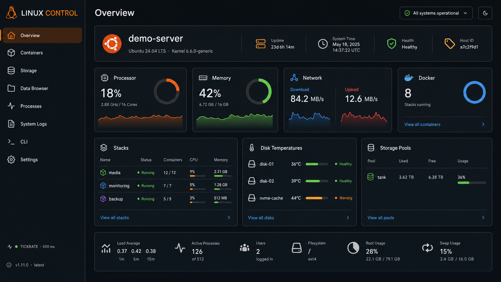
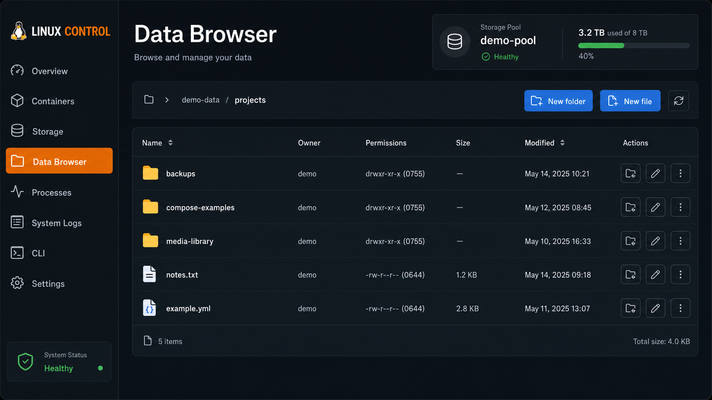

# Ubuntu Dashboard


[](https://github.com/Maomao63/ubuntu-dashboard/actions/workflows/docker-publish.yml)

A responsive, Unraid-inspired control center for Linux servers. Ubuntu Dashboard
runs as a single Docker container and provides live host monitoring, Docker
management, storage health, a writable data browser, an SSH terminal and
configurable Discord alerts. An optional iFrame workspace can bring existing
Homarr, Homepage and other browser-accessible Docker web interfaces into the
same dashboard.

Despite its name, it is not limited to Ubuntu. The dashboard detects the host
distribution and adapts its branding for Ubuntu, Debian, Fedora/RHEL-based
systems, Arch-based systems, openSUSE and other Linux distributions. Unraid
arrays are supported as one storage type, but Unraid is not required.

> [!IMPORTANT]
> Ubuntu Dashboard requires a **Linux Docker host**. Host telemetry depends on
> Linux interfaces such as `/proc`, `/sys`, block devices and the Docker socket.
> Docker Desktop on Windows or macOS cannot expose the same host information.

## Screenshots





All screenshots use generated demonstration data. They contain no production
host names, addresses, account names, paths or other user information.

## New: Multi-view iFrame workspace

The optional iFrame tab can now hold multiple named web interfaces instead of
just one address. Add separate entries for tools such as Homepage, Homarr,
SABnzbd or other container WebUIs, then switch the visible interface from the
compact dropdown above the embedded page.

- Disabled by default and activated from **Settings → Embedded dashboards**
- Multiple named URL and port combinations with add, edit and remove actions
- Fast switching between saved views without changing the dashboard setup
- Compact, collapsible Settings card that does not crowd the page
- Independent persistence in `iframe.json`, next to the main `config.json`
- Automatic migration of existing single-URL iFrame configurations

The configured address must be reachable by the user's browser. The embedded
application must also permit framing; applications that send restrictive
`X-Frame-Options` or `Content-Security-Policy: frame-ancestors` headers can
still refuse to load inside any dashboard.

## Highlights

- Live CPU, memory and network telemetry with a 500 ms dashboard tick rate
- Separate download and upload rates with blue/red history graphs
- Automatic default-route interface detection or explicit interfaces such as
  `bond0`, `eno1` or `eno1,eno2`
- SMART health, running state and temperatures for HDD, SATA SSD and NVMe drives
- Flexible storage views for Unraid arrays, ZFS pools/VDEVs, Linux md-RAID,
  LVM, Btrfs and standalone Linux disks
- Docker stack summary on the overview and individual containers in the
  Containers page
- Container start, stop and restart actions
- Green, yellow and red Docker health indicators and registry image-update hints
- Docker network inventory with custom bridge-network creation, protected
  defaults and confirmation-gated deletion
- Accurate connected-container counts from Docker network inspection
- Writable Data Browser with automatic SMB, NFS and mounted-data-root detection
- File owner, group, symbolic permissions and octal mode display
- Create, edit and delete folders and UTF-8 text/YAML/configuration files
- Instant file and folder name search in the current Data Browser directory
- Optional multi-view iFrame tab with named entries, dropdown selection and
  separate persistent configuration
- Interactive host terminal backed by a real SSH session
- Host process and classic log-file views
- Drag-and-drop overview layout with browser-local persistence
- Automatic distribution branding and responsive desktop/mobile layout
- English interface plus German, French, Spanish, Italian, Portuguese, Dutch
  and Polish language packs
- Persistent Discord webhook monitor for disk, container and system alerts
- Login sessions, HttpOnly cookies, CSRF protection and login rate limiting
- GitHub version check and a container health check

## Requirements

- A Linux server with Docker Engine
- Docker Compose v2, Arcane or another Compose-compatible manager
- `linux/amd64` or `linux/arm64`
- Port `8080` available, or another port configured through `DASHBOARD_PORT`
- A running SSH server if the integrated CLI should be used
- Outbound HTTPS access for GitHub version checks, registry update checks and
  optional Discord notifications

The published image is:

```text
ghcr.io/maomao63/ubuntu-dashboard:latest
```

## Quick start

Clone the repository, create the environment file and start the published
image:

```bash
git clone https://github.com/Maomao63/ubuntu-dashboard.git
cd ubuntu-dashboard
cp .env.example .env
nano .env
docker compose up -d
```

At minimum, replace the example password in `.env`:

```dotenv
DASHBOARD_USER=admin
DASHBOARD_PASSWORD=use-a-long-unique-password
```

Open:

```text
http://SERVER-IP:8080
```

Check the deployment:

```bash
docker compose ps
docker compose logs --tail=100 ubuntu-dashboard
```

## Universal Docker Compose

The repository intentionally contains **one** deployment file. The same
`compose.yml` works with Docker Compose, Arcane and other Compose-compatible
Linux management interfaces:

```yaml
services:
  ubuntu-dashboard:
    image: ghcr.io/maomao63/ubuntu-dashboard:latest
    pull_policy: always
    container_name: ubuntu-dashboard
    restart: unless-stopped
    privileged: true
    ports:
      - "${DASHBOARD_PORT:-8080}:8080"
    environment:
      DASHBOARD_USER: "${DASHBOARD_USER:-admin}"
      DASHBOARD_PASSWORD: "${DASHBOARD_PASSWORD:-change-this-password-now}"
      ALLOW_DOCKER_ACTIONS: "${ALLOW_DOCKER_ACTIONS:-true}"
      SHARE_ROOTS: "${SHARE_ROOTS:-}"
      SSH_HOST: "${SSH_HOST:-auto}"
      SSH_PORT: "${SSH_PORT:-22}"
      NETWORK_INTERFACE: "${NETWORK_INTERFACE:-auto}"
      COOKIE_SECURE: "${COOKIE_SECURE:-false}"
      SESSION_TTL: "${SESSION_TTL:-43200}"
    volumes:
      - type: bind
        source: /
        target: /host
      - type: bind
        source: /proc/1/mounts
        target: /host-proc-mounts
        read_only: true
      - type: bind
        source: /proc/1/net/route
        target: /host-proc-net-route
        read_only: true
      - /sys:/host/sys:ro
      - /var/run/docker.sock:/var/run/docker.sock
      # Persistent dashboard configuration. May be an absolute host path.
      - "${DASHBOARD_CONFIG_PATH:-./config}:/data"
    read_only: true
    tmpfs:
      - /tmp:size=16M,mode=1777
```

`pull_policy: always` makes a new deployment fetch the current `:latest`
image. The container itself remains read-only; only `/tmp`, the persistent
configuration directory and the explicitly mounted host paths are writable.
`DASHBOARD_CONFIG_PATH` may point to any relative or absolute host directory.
The directory contains `config.json` with the account and Discord preferences.
Enabling the optional iFrame tab creates a separate `iframe.json`.

## Persistent configuration

The container writes all server-side dashboard configuration to `/data`.
Compose maps that directory to the host path selected with
`DASHBOARD_CONFIG_PATH`:

```dotenv
# Directory next to compose.yml
DASHBOARD_CONFIG_PATH=./config

# Or an absolute host directory
DASHBOARD_CONFIG_PATH=/srv/ubuntu-dashboard/config

# Unraid example
DASHBOARD_CONFIG_PATH=/mnt/user/appdata/ubuntu-dashboard
```

Relative paths are resolved from the directory containing `compose.yml`.
Absolute paths are recommended for server management interfaces such as
Arcane. Docker creates the directory when it does not exist. It must remain
writable by the container.

| File | Contents |
| --- | --- |
| `config.json` | Account, Discord webhook and notification preferences |
| `iframe.json` | iFrame enable state, named web-interface views and current selection |

The Discord webhook token and password hash are sensitive. Do not commit the
configuration directory to Git, and include it in protected server backups.
Browser-only preferences such as language and card order remain in the
browser's local storage.

## Optional iFrame tab

The iFrame tab is disabled by default. Enable it under
**Settings → Embedded dashboards → iFrame tab**. The same settings card lets
you add, edit or remove multiple named views for Homarr, Homepage or any other
browser-accessible Docker web interface. The compact card expands when its
header or arrow is selected. The Discord watchdog card follows the same
collapsible layout to keep Settings compact. Disabling the iFrame switch
immediately removes the navigation entry, unloads the embedded page and
redirects an open iFrame tab back to the overview.

Choose **Add**, give the view a name and enter the address your browser uses:

```text
Name: Homepage
URL:  http://192.168.1.20
Port: 7575
```

The saved views and the current selection are stored in `iframe.json`. On the
iFrame tab, use the compact dropdown above the embedded page to switch between
them. Existing single-URL configurations are migrated automatically into a
named `Dashboard` view. Use a browser-accessible host address; a Compose
service name such as `homarr` normally resolves only inside Docker. When the
dashboard itself is served over HTTPS, the embedded page should also use HTTPS
to avoid browser mixed-content blocking. The target application or reverse
proxy must permit embedding and must not send a conflicting `X-Frame-Options`
or `frame-ancestors` policy.

### Migrating from the former named volume

Releases that used `ubuntu-dashboard-data:/data` stored these files in a Docker
named volume. They are not copied automatically when switching to a host
directory. Stop the dashboard, find the old volume name and copy its contents:

```bash
docker compose down
docker volume ls --format '{{.Name}}' | grep 'ubuntu-dashboard-data$'
mkdir -p ./config
docker run --rm \
  --mount type=volume,src=YOUR_OLD_VOLUME_NAME,dst=/from,readonly \
  --mount type=bind,src="$(pwd)/config",dst=/to \
  alpine sh -c 'cp -a /from/. /to/'
docker compose up -d
```

Replace `YOUR_OLD_VOLUME_NAME` with the name printed by `docker volume ls`. If
an absolute `DASHBOARD_CONFIG_PATH` is configured, use that same absolute path
as the `src` of the bind mount instead of `$(pwd)/config`. Keep the old volume
until the migrated account and Discord settings have been verified.

On the first start, legacy `account.json` and `notifications.json` files are
automatically imported into `config.json`. The legacy files are left untouched
as a migration backup.

## Arcane installation

1. Open **Projects** in Arcane and create a new Compose project.
2. Paste the contents of [`compose.yml`](compose.yml).
3. Add the values from [`.env.example`](.env.example) in the project's
   environment editor.
4. Set `DASHBOARD_CONFIG_PATH` to an absolute persistent host directory, for
   example `/srv/ubuntu-dashboard/config`.
5. Set a strong `DASHBOARD_PASSWORD`.
6. If automatic network detection does not select the correct interface, set
   `NETWORK_INTERFACE`, for example to `bond0`.
7. Deploy the project and open `http://SERVER-IP:8080`.

Arcane must use the complete GHCR image name. If it tries to pull
`ubuntu-dashboard:latest` from Docker Hub, the project still contains an old
Compose definition. Replace it with:

```yaml
image: ghcr.io/maomao63/ubuntu-dashboard:latest
```

There is no `build:` section in the deployment Compose because Arcane should
pull the ready-to-use image instead of requiring the repository as a build
context.

## Environment configuration

Example `.env`:

```dotenv
DASHBOARD_PORT=8080
DASHBOARD_USER=admin
DASHBOARD_PASSWORD=use-a-long-unique-password
DASHBOARD_CONFIG_PATH=./config
ALLOW_DOCKER_ACTIONS=true
SHARE_ROOTS=
SSH_HOST=auto
SSH_PORT=22
NETWORK_INTERFACE=auto
COOKIE_SECURE=false
SESSION_TTL=43200
```

| Variable | Default | Description |
| --- | --- | --- |
| `DASHBOARD_PORT` | `8080` | Port exposed on the Docker host |
| `DASHBOARD_USER` | `admin` | Username used to create the initial account |
| `DASHBOARD_PASSWORD` | `change-this-password-now` | Initial account password; change before deployment |
| `DASHBOARD_CONFIG_PATH` | `./config` | Host directory containing `config.json` and optional `iframe.json` |
| `ALLOW_DOCKER_ACTIONS` | `true` | Allows container start, stop and restart actions |
| `SHARE_ROOTS` | empty | Additional comma-separated Data Browser roots |
| `SSH_HOST` | `auto` | SSH target; `auto` uses the dashboard host name or IP |
| `SSH_PORT` | `22` | Host SSH port |
| `NETWORK_INTERFACE` | `auto` | Interface, bond or comma-separated interfaces to monitor |
| `COOKIE_SECURE` | `false` | Send the login cookie over HTTPS only |
| `SESSION_TTL` | `43200` | Login-session lifetime in seconds |

The environment credentials create the account only when no persistent account
exists yet. Changes made in **Settings** are stored as a PBKDF2 password hash in
`DASHBOARD_CONFIG_PATH` and take precedence after restarts.

## Host integration

The mounts in `compose.yml` have distinct purposes:

| Mount | Purpose | Access |
| --- | --- | --- |
| `/:/host` | Host identity, logs, data roots, filesystems and Data Browser | Read/write |
| `/proc/1/mounts` | Host mount table instead of the container mount namespace | Read-only |
| `/proc/1/net/route` | Host default-route detection | Read-only |
| `/sys:/host/sys` | Network counters, block devices and hardware telemetry | Read-only |
| `/var/run/docker.sock` | Docker inventory, health and container actions | Read/write |
| `${DASHBOARD_CONFIG_PATH:-./config}:/data` | `config.json` and optional `iframe.json` | Persistent, read/write |

`privileged: true` is required for broad physical-disk and SMART access across
different Linux hosts. Virtual machines may expose only virtual disks and no
temperature sensors; in that case missing temperature values are expected.

### Storage support

| Storage type | Dashboard representation |
| --- | --- |
| Unraid | Array, parity/data members and separate cache/pool devices |
| ZFS | Pool capacity, health, VDEVs and physical members |
| Linux md-RAID | RAID level, member devices and degraded state |
| LVM | Logical storage grouping, physical members and filesystem usage |
| Btrfs | Filesystem/pool, devices, capacity and health |
| Standalone disks | Device/model, type, capacity, health and mount usage |

SMART availability still depends on the host controller and drive passthrough.
Some USB bridges, hardware RAID controllers and virtual disks do not expose
SMART data to containers.

### Data Browser

The Data Browser automatically looks for:

- Samba share definitions
- NFS exports
- Mounted data disks below common Linux paths
- Distribution-appropriate directories such as `/home`, `/srv`, `/mnt`,
  `/media`, `/data` and `/storage`
- Additional roots configured with `SHARE_ROOTS`

It can create folders and text files, edit UTF-8 files up to 2 MB, and delete
files or complete folders after an explicit confirmation. Symbolic links are
not writable through the browser, and paths cannot escape the selected root.

### Host SSH terminal

The CLI tab opens a real SSH session to the host. It has the same permissions
as the supplied SSH account, including `sudo` only when that account is allowed
to use it. The SSH password is used for the active connection and is not stored
by the dashboard.

On Ubuntu/Debian, an SSH server can be enabled with:

```bash
sudo apt update
sudo apt install openssh-server
sudo systemctl enable --now ssh
```

For Fedora/RHEL-based hosts:

```bash
sudo dnf install openssh-server
sudo systemctl enable --now sshd
```

If `SSH_HOST=auto` cannot resolve the correct target behind a reverse proxy,
set the server address explicitly:

```dotenv
SSH_HOST=192.168.1.20
SSH_PORT=22
```

### Discord notifications

Open **Settings → Discord notifications**, paste a Discord webhook URL and
select the alert categories:

- disk health and temperature problems
- unhealthy, restarting or stopped Docker workloads
- general host/system problems

Mentions and the repeat interval are configurable, and a test button verifies
the webhook. The webhook secret is saved with file mode `0600` in the
persistent data volume and is never returned to the browser after saving.

### Docker networks

The **Networks** page lists built-in, Compose and custom Docker networks with
their driver, subnet, gateway, scope and attached-container count. Every
network starts as a compact row and expands independently to show its details
and actions, keeping larger network inventories easy to scan. Custom bridge
networks can be created with optional IPAM settings. Built-in networks are
protected; deleting a custom network requires typing its exact name, and Docker
rejects removal while containers are still attached.

## Updating

The Compose file tracks `:latest`. Pull and recreate the container to install a
new release:

```bash
docker compose pull
docker compose up -d --force-recreate
docker image prune -f
```

In Arcane, use **Pull** followed by **Redeploy**. A browser refresh alone does
not replace a running container image.

Dashboard settings survive updates because they are stored in the persistent
directory selected with `DASHBOARD_CONFIG_PATH`.

## Security

This dashboard intentionally has administrator-level host integrations:

- the Docker socket can control Docker workloads
- network creation and deletion use that Docker socket and require
  `ALLOW_DOCKER_ACTIONS=true`
- the writable `/host` mount powers the Data Browser
- privileged mode enables hardware and SMART discovery
- an authenticated SSH account can open a host shell

Treat access to the dashboard as access to the server itself.

- Change the example username and password before the first deployment.
- Keep the service on a trusted management network or behind a VPN.
- Do not expose port `8080` directly to the public internet.
- For remote access, use a reverse proxy with HTTPS and set
  `COOKIE_SECURE=true`.
- Add authentication and rate limiting at the reverse proxy as an additional
  layer.
- Use a dedicated SSH account with only the permissions it requires.
- Set `ALLOW_DOCKER_ACTIONS=false` if container control is not needed.
- Back up the directory selected with `DASHBOARD_CONFIG_PATH` with the rest of
  the host.

## Troubleshooting

### `pull access denied for ubuntu-dashboard`

The old short image name points Docker at Docker Hub. Use:

```yaml
image: ghcr.io/maomao63/ubuntu-dashboard:latest
```

No Docker Hub login is required for the public GHCR image.

### Network values are missing or show the wrong interface

Find the interface used by the default route:

```bash
ip route show default
```

Then set it explicitly, for example:

```dotenv
NETWORK_INTERFACE=bond0
```

Multiple interfaces can be aggregated with:

```dotenv
NETWORK_INTERFACE=eno1,eno2
```

### Disks or temperatures are missing

Verify that the current Compose is deployed with `privileged: true`, the root
host mount and `/sys:/host/sys:ro`. Also check whether the host itself exposes
SMART information:

```bash
sudo smartctl --scan
sudo smartctl -a /dev/sda
```

Virtual disks and some storage controllers do not expose temperatures.

### Docker remains unavailable

Verify the socket and container logs:

```bash
ls -l /var/run/docker.sock
docker compose logs --tail=200 ubuntu-dashboard
```

Rootless Docker uses a different socket path and requires the Compose mount to
be adapted to that host-specific socket.

### The SSH terminal cannot connect

Confirm that SSH listens on the configured host and port:

```bash
ss -lnt | grep ':22'
ssh USER@SERVER-IP
```

If direct SSH works but `auto` does not, set `SSH_HOST` explicitly.

### Changed `.env` credentials are ignored

The account saved in the persistent configuration directory intentionally
overrides the initial environment values. Change the credentials in the
dashboard Settings page.
Removing the contents of `DASHBOARD_CONFIG_PATH` resets all persistent
dashboard settings, including the account and Discord webhook, and should only
be done when that data is no longer needed.

## Local development

Build the current source under a separate local tag:

```bash
git clone https://github.com/Maomao63/ubuntu-dashboard.git
cd ubuntu-dashboard
docker build --pull \
  --build-arg APP_VERSION=dev \
  -t ubuntu-dashboard:dev .
```

The application uses a Python standard-library backend and a dependency-light
HTML/CSS/JavaScript frontend. Xterm assets are bundled into the image during
the multi-stage build; no CDN is required at runtime.

Published images for `main` and version tags are built by GitHub Actions for
both AMD64 and ARM64 and pushed to GitHub Container Registry.
